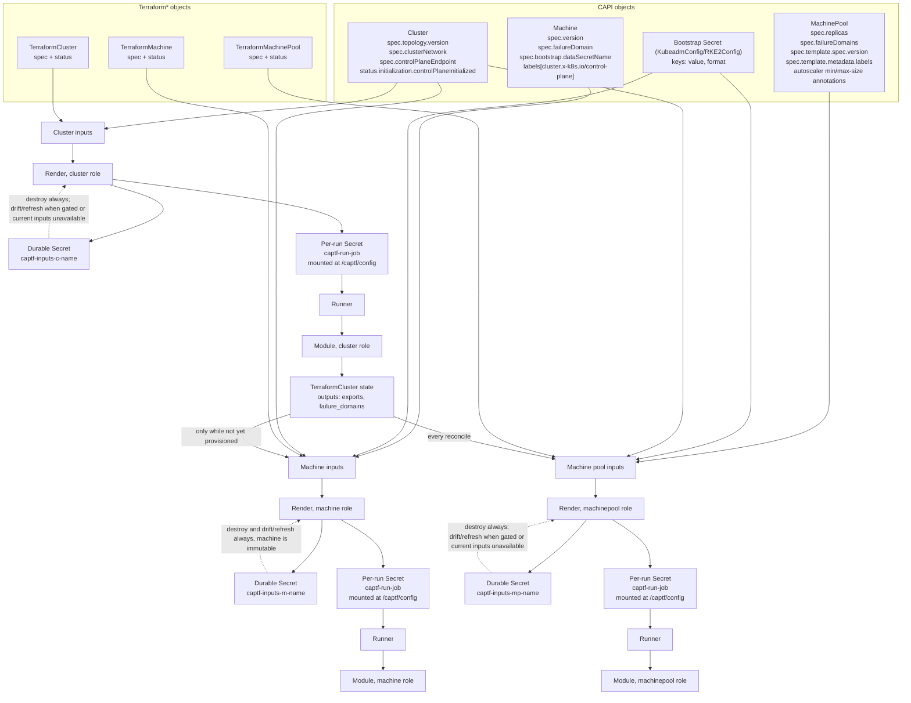

# Job Inputs

This explains what goes into a CAPTF Job's Terraform inputs —
`terraform.tfvars.json` and the generated root `main.tf.json` — and where
each value comes from on the Kubernetes side. For each input's type and
whether it is required, see the [module
contract](../module-author/contract/v1alpha1/README.md); this page traces
the plumbing that fills the contract in, for anyone administering CAPTF or
writing a module against it.

A `TerraformCluster` runs the module's `cluster` role, each `TerraformMachine`
runs its `machine` role, and each `TerraformMachinePool` runs its
`machinepool` role. All three roles are rendered the same way from the same
kind of input structure, so this page covers all three side by side.

## 1. The pipeline



Why two Secrets exist:

- **Durable inputs Secret** (`captf-inputs-<kindshort>-<name>`, owned by the
  Terraform\* object, moves with it across `clusterctl move`): the record of
  what was rendered when the controller last **started** an apply Job for
  this object (written at Job start, not gated on the Job's success).
  Destroy always prefers it; a **cluster or pool** (both mutable) whose
  durable Secret is missing falls back to freshly built current inputs, but
  a **machine** (immutable) never does — with no durable Secret and no live
  spec to fall back to, destroy has nothing to run against until the Secret
  is restored. Drift and refresh follow the same asymmetry: a cluster or
  pool checks against its *current* inputs when they build cleanly, falling
  back to the durable Secret only when they don't (a dependency gate, an
  owner gone); a machine, being immutable, always checks against the durable
  Secret.
- **Per-run Secret** (`captf-run-<job>`, owned by the Job, mounted at
  `/captf/config`, deleted when the Job finishes): a private copy the Job's
  pod reads, so a rewrite of the durable Secret by a later reconcile can
  never change the files under a running Job.

## 2. Cluster role inputs

For the full type table, see
[`contract/v1alpha1/common.md`](../module-author/contract/v1alpha1/common.md)
and
[`cluster.md`](../module-author/contract/v1alpha1/cluster.md). The
Kubernetes-side sources are:

| tfvars key | Type | Source |
| --- | --- | --- |
| `captf_contract` | `string` | The fixed contract version, `"v1alpha1"` |
| `captf_cluster` | `object{name,namespace}` | The owning `Cluster`'s `metadata.name`/`metadata.namespace` |
| `captf_object` | `object{kind,name,namespace}` | The `TerraformCluster`'s own kind/name/namespace |
| `captf_tags` | `map(string)` | Fixed keys built from the `Cluster` name, the `TerraformCluster` namespace/kind/name, and its `cluster.x-k8s.io/cloned-from-name` annotation (empty string if absent) |
| `control_plane_endpoint` | `object{host,port}` or `null` | `Cluster.spec.controlPlaneEndpoint` when valid; else `TerraformCluster.spec.controlPlaneEndpoint` when valid; else `null`. Always `null` once the `captf.io/endpoint-source` annotation is `module` |
| `kubernetes_version` | `string` or `null` | `Cluster.spec.topology.version`; `null` without a ClusterClass |
| `control_plane_initialized` | `bool` | `Cluster.status.initialization.controlPlaneInitialized`, **latched**: `true` once the durable Secret's last rendered value was `true`, so it is never rendered `false` again after an apply saw `true` |
| `cluster_network` | `object{pods,services,service_domain,api_server_port}` or `null` | `Cluster.spec.clusterNetwork`; `null` only when every attribute is unset. CIDR lists render as `[]`, not `null`, when the network object is present but a list is empty |

A trimmed real example:

```json
{
  "captf_contract": "v1alpha1",
  "captf_cluster": { "name": "prod", "namespace": "team-a" },
  "captf_object": { "kind": "TerraformCluster", "name": "prod", "namespace": "team-a" },
  "captf_tags": {
    "captf.io/cluster": "prod",
    "captf.io/kind": "TerraformCluster",
    "captf.io/managed-by": "captf",
    "captf.io/name": "prod",
    "captf.io/namespace": "team-a",
    "captf.io/template": ""
  },
  "control_plane_endpoint": { "host": "api.prod.example.com", "port": 6443 },
  "kubernetes_version": "v1.36.2",
  "control_plane_initialized": true,
  "cluster_network": {
    "pods": ["192.168.0.0/16"],
    "services": ["10.96.0.0/12"],
    "service_domain": "cluster.local",
    "api_server_port": 6443
  }
}
```

The matching root `main.tf.json` declares one Terraform variable per key
above (nullable ones get `"default": null`), a `module "role"` call
forwarding every variable by name to the module, and a `sensitive = true`
re-export of every required cluster output (`control_plane_endpoint`,
`failure_domains`, `exports`, `health`). The cluster role never declares
`captf_cluster_outputs`: it has no such input at all, not even `null`.

## 3. Machine role inputs

For the full type table, see
[`common.md`](../module-author/contract/v1alpha1/common.md) and
[`machine.md`](../module-author/contract/v1alpha1/machine.md). The
Kubernetes-side sources are:

| tfvars key | Type | Source |
| --- | --- | --- |
| `captf_contract`, `captf_cluster`, `captf_object`, `captf_tags` | as above | Same construction as the cluster role, but `captf_object`/`captf_tags` name the `TerraformMachine` |
| `captf_cluster_outputs` | `any` | The owning `TerraformCluster`'s `exports` output, verbatim ([section 5](#5-what-a-cluster-hands-to-its-machines-and-pools)). `{}` for an externally managed cluster |
| `machine_name` | `string` | The owning `Machine`'s `metadata.name` (may differ from the `TerraformMachine`'s own name) |
| `bootstrap_data` | `string`, sensitive | **Base64** (standard, padded) of the raw bytes of the bootstrap Secret's `value` key, named by `Machine.spec.bootstrap.dataSecretName`. Encoded unconditionally for every bootstrap provider, since a gzip payload (CAPRKE2 `gzipUserData: true`) is not valid UTF-8 and cannot be a JSON/HCL string as-is. Contains the cluster CA and service-account keys for control-plane machines — treat it as a secret |
| `bootstrap_format` | `string` | The bootstrap Secret's `format` key (`cloud-config` or `ignition`); `cloud-config` when the key is absent |
| `failure_domain` | `string` or `null` | `Machine.spec.failureDomain`; `null` when unset |
| `kubernetes_version` | `string` or `null` | `Machine.spec.version`, passed verbatim (may carry a distro suffix such as `+rke2r1`) |
| `control_plane` | `bool` | Whether the owning `Machine` carries the `cluster.x-k8s.io/control-plane` label |

A trimmed real example:

```json
{
  "captf_contract": "v1alpha1",
  "captf_object": { "kind": "TerraformMachine", "name": "prod-md-0-abcde", "namespace": "team-a" },
  "captf_cluster_outputs": { "network_id": "net-1", "note": "a<b & c>d" },
  "machine_name": "prod-md-0-abcde-xyz12",
  "bootstrap_data": "I2Nsb3VkLWNvbmZpZwpydW5jbWQ6...",
  "bootstrap_format": "cloud-config",
  "failure_domain": null,
  "kubernetes_version": "v1.36.2",
  "control_plane": false
}
```

The `note: "a<b & c>d"` above is deliberate: the machine role's renderer
keeps a module-authored `exports` value's exact bytes through the durable
Secret instead of turning `<`/`&` into their `\u...` escapes ([section
5](#5-what-a-cluster-hands-to-its-machines-and-pools) has the one exception
to this).

The root variables and re-exported outputs (`provider_id`, `addresses`,
`failure_domain`, `interruptible`, `health`) follow the same pattern as the
cluster role.

## 4. Machine pool role inputs

A `TerraformMachinePool` runs the module's `machinepool` role. For the full
type table and lifecycle, see
[`contract/v1alpha1/machinepool.md`](../module-author/contract/v1alpha1/machinepool.md)
(this page does not duplicate it). Its inputs follow the same
`captf_contract`/`captf_cluster`/`captf_object`/`captf_tags` pattern as the
cluster and machine roles, plus `captf_cluster_outputs` (the owning
TerraformCluster's `exports`, as for a machine), and these role-specific
inputs:

| tfvars key | Type | Source |
| --- | --- | --- |
| `machinepool_name` | `string` | The owning `MachinePool`'s `metadata.name` |
| `replicas` | `number` | The group's desired capacity. With autoscaling disabled: `MachinePool.spec.replicas` (1 when unset, CAPI's own default). With autoscaling enabled: `TerraformMachinePool.status.replicas` (the observed count from the last refresh) once one exists, else still `spec.replicas` for the first apply — either way clamped into `[autoscaling.min, autoscaling.max]`. The write-back that syncs the raw observed count to `spec.replicas` is unclamped; see [Machine pools](../user-guide/machine-pools.md) |
| `bootstrap_data`, `bootstrap_format` | as machine role | From the bootstrap Secret named by `MachinePool.spec.template.spec.bootstrap.dataSecretName`, encoded exactly as for a machine. Because the kubeadm bootstrap provider rewrites this Secret roughly every 7.5 minutes, a pool is re-applied at that cadence for its whole life; see [the machinepool contract](../module-author/contract/v1alpha1/machinepool.md#lifecycle) "Bootstrap rotation" |
| `failure_domains` | `list(string)` | `MachinePool.spec.failureDomains`; may be `[]`, meaning the module chooses |
| `cluster_failure_domains` | `list(string)` | The names of the owning `TerraformCluster`'s own failure domains — from its state's `failure_domains` output when it has state, else from `TerraformCluster.status.failureDomains` for an externally managed cluster. Lets a pool module spread across every domain when `failure_domains` is `[]` |
| `kubernetes_version` | `string` or `null` | `MachinePool.spec.template.spec.version`; `null` when unset |
| `node_labels` | `map(string)` | `MachinePool.spec.template.metadata.labels` verbatim; `{}` when absent. Pool instances have no Machine objects, so core CAPI never syncs labels onto their Nodes; the module renders these into the bootstrap or agent configuration it controls |
| `autoscaling` | `object{enabled,min,max}` | Parsed from the owning `MachinePool`'s `cluster.x-k8s.io/cluster-api-autoscaler-node-group-min-size`/`-max-size` annotations, not from the TerraformMachinePool spec: a pool has no autoscaling field of its own. `enabled` is `true` only when both annotations are present and parse as `0 <= min <= max`; otherwise `{false, 0, 0}` |

Unlike a `TerraformMachine`, a `TerraformMachinePool` is mutable: its inputs
are rebuilt, and its inputs hash recomputed, on every reconcile for the
whole life of the object, not only until it is provisioned; see
[`machinepool.md`](../module-author/contract/v1alpha1/machinepool.md#lifecycle)
for exactly which changes re-apply it.

The pool role's renderer defaults `failure_domains`, `cluster_failure_domains`
and `node_labels` to `[]`/`{}` when unset through a step that, as a side
effect, HTML-escapes `<`, `>` and `&` inside every string value it
touches — including a module-authored `exports` value carried into
`captf_cluster_outputs`. The cluster and machine roles do not escape these
characters (section 3's example). A `\uXXXX` escape and its literal
character decode to the same JSON string, so a module never sees a
difference; only someone reading the raw Secret bytes does. Still, don't
assume the two roles' encodings match byte for byte when inspecting one.

## 5. What a cluster hands to its machines and pools

The cluster module's `exports` output is the only handoff from a
`TerraformCluster` to the `TerraformMachine`s and pools of its `Cluster`. It
is:

1. Written by the cluster module as any Terraform value (an object is the
   convention).
2. Stored, like every output, in the cluster's own Terraform state — nothing
   else from that state is ever read by the controller for this purpose.
3. Read by each machine's or pool's own reconcile whenever it builds its
   inputs, and rendered into `captf_cluster_outputs` (see section 4 for the
   pool role's one encoding difference).

**When it is read.** A machine's inputs (and so `exports`) are rebuilt on
every reconcile while it is not yet provisioned — before its status has
latched `status.initialization.provisioned = true` — whether or not that
reconcile ends up starting a Job. Once provisioned, the reconciler never
rebuilds that machine's inputs again, so it never re-reads `exports` or the
bootstrap Secret. Concretely:

- **Before a machine is provisioned**, every reconcile re-reads the
  cluster's current `exports` and re-renders `captf_cluster_outputs` from it
  (along with the rest of the machine's inputs). Only when an apply Job
  actually starts does the freshly rendered result get written to the
  durable Secret; a reconcile that only re-renders without starting a Job
  leaves the durable Secret untouched.
- **Once provisioned, a machine keeps exactly the `captf_cluster_outputs`
  its last apply Job start wrote to its durable Secret**, forever: a later
  change to the cluster's `exports` reaches only *new* machines created
  after that change, never existing ones. This is also why
  `captf_cluster_outputs` changes are never a trigger for a machine
  re-apply: machines are immutable, so their inputs hash, though recorded
  at apply time like any kind's, is never compared against a fresh render
  to decide on a re-apply, and the only way a machine applies again is a
  fresh first apply (for example, retrying one that was interrupted before
  it recorded an inputs hash).
- **A pool re-reads `exports` on every reconcile, for its whole life**,
  unlike a machine: a `TerraformMachinePool` is mutable and never latches
  `captf_cluster_outputs`, so a later change to the cluster's `exports`
  reaches every existing pool at its next reconcile, and (unlike a machine)
  a changed `captf_cluster_outputs` is in the pool's inputs hash and so
  re-applies it.
- **Externally managed cluster** (`cluster.x-k8s.io/managed-by` annotation
  on the `TerraformCluster`): a machine's or pool's `captf_cluster_outputs`
  is `{}` without reading any state, since there is no cluster module run
  and so no cluster state to read.
- **A malformed `exports` value** — one that cannot be canonicalized for
  hashing, for example it contains a fractional or exponent number — is an
  output violation on the cluster side. Every unprovisioned machine, and
  every pool, waiting on it stays `DependenciesReady=Unknown` with reason
  `WaitingForClusterExports` until the cluster module's `exports` output
  is fixed; this is the one operator-visible way a cluster module can break
  its machines and pools purely through inputs.

A concrete example is the libvirt modules: the cluster module's `exports`
publishes

```hcl
output "exports" {
  value = {
    network = local.network
    pool    = local.pool
    vip     = local.vip
    lease   = libvirt_volume.vip_lease.name
  }
}
```

and the machine module's `captf_cluster_outputs` variable carries a
`validation` block that rejects any value missing `network`, `pool` or
`lease` — refusing to run against an externally managed cluster (`{}`) or
a cluster module that doesn't publish a lease, with a clear error instead of
an "unsupported attribute" failure deep inside the module.

## 6. User variables

Besides the contract inputs, a `TerraformCluster`, `TerraformMachine` or
`TerraformMachinePool` (and their templates) can pass the module its own
variables: instance sizes, CIDRs, SSH public keys, anything the module
declares. See [Module Variables](../user-guide/variables.md) for how to set
them, the merge order between `spec.variables` and `spec.variablesFrom`, and
what the module sees.

## 7. What is (and isn't) in the inputs hash

`captf.io/inputs-hash` covers exactly: the hash scheme, the contract
version, the role, `spec.source.image` **as written** (tag or digest —
never the resolved digest), the full rendered inputs of the role, and the
merged user variables when there are any (their canonical JSON and which of
them are sensitive; an object without variables keeps exactly the hash it
had before variables existed). Nothing else can change the hash: object
metadata (`uid`, labels, annotations, `generation`), the resolved image
digest, Job metadata, drift ticks, and `spec.source.imagePullPolicy` are
all absent from the hashed value and so cannot trigger anything through
it.

What a change does, per kind:

- **TerraformCluster (mutable).** A hash change re-applies: the controller
  compares the freshly rendered inputs' hash against the state's recorded
  hash on every reconcile and starts a new apply Job when they differ. A
  cluster apply that would delete or replace a resource is blocked
  (`ApplyJobSucceeded=False/DestructivePlanBlocked`) until the
  `captf.io/approve-destructive-plan` annotation names that exact inputs
  hash, and with `spec.applyPolicy: Manual` every re-apply also waits for a
  plan approval; see [Plan Approval](../user-guide/plan-approval.md).
- **TerraformMachine (immutable).** Nothing, in the sense that matters: a
  machine's inputs hash is recorded at apply time like any kind's, but
  never compared against a fresh render to decide on a re-apply. Its
  inputs are still rebuilt on every reconcile up to the
  first successful apply (section 5), but once that apply has run and the
  object is provisioned, nothing — not a spec field, not a bootstrap-data
  change, not an `exports` change — is ever rendered or checked against it
  again. Roll out a new Machine instead.
- **TerraformMachinePool (mutable).** A hash change re-applies, the same
  way as a TerraformCluster, but with no destructive-plan guard and no
  `applyPolicy`: an apply just runs. `replicas` is excluded from the hash
  while autoscaling is enabled, so the native autoscaler's own scaling
  never triggers a re-apply on its own; see
  [`machinepool.md`](../module-author/contract/v1alpha1/machinepool.md#inputs)
  "replicas".

## 8. Inspecting the inputs of a live object

The durable Secret holds exactly two data keys, `main.tf.json` and
`terraform.tfvars.json`, plus three annotations recording the pinned
execution context: `captf.io/image`, `captf.io/image-digest`,
`captf.io/identity`. Its name follows the pattern
`captf-inputs-c-<cluster-name>` for a `TerraformCluster`,
`captf-inputs-m-<machine-name>` for a `TerraformMachine`, and
`captf-inputs-mp-<pool-name>` for a `TerraformMachinePool`.

To print the tfvars **without** the sensitive `bootstrap_data` key:

```sh
kubectl -n <namespace> get secret captf-inputs-m-<name> \
  -o jsonpath='{.data.terraform\.tfvars\.json}' | base64 -d | jq 'del(.bootstrap_data)'
```

That still prints user variables that came from a Secret. To drop them too,
delete every key the generated root declares sensitive:

```sh
s=$(kubectl -n <namespace> get secret captf-inputs-m-<name> -o json)
sensitive=$(jq -r '.data["main.tf.json"] | @base64d | fromjson | .variable // {}
  | to_entries | map(select(.value.sensitive == true) | .key) | @json' <<<"$s")
jq -r '.data["terraform.tfvars.json"] | @base64d | fromjson' <<<"$s" \
  | jq --argjson drop "$sensitive" 'del(.bootstrap_data) | delpaths([$drop[] | [.]])'
```

**Warning:** both the durable Secret (`captf-inputs-<kindshort>-<name>`) and
the per-run Secret (`captf-run-<job>`) carry bootstrap data in cleartext by
design — for control-plane machines that includes the cluster CA and
service-account private keys. Treat both Secrets as sensitive: avoid
`kubectl get -o yaml` or `-o json` on them, which print every key including
`bootstrap_data` unredacted (`kubectl describe secret` is safe: it prints
only key names and byte counts, never values).

## 9. Limits

The rendered root (`main.tf.json` plus `terraform.tfvars.json` combined) is
capped at 1,000,000 bytes, comfortably under the ~1 MiB a Kubernetes object
can hold, with headroom for the Secret's own metadata (labels, annotations,
owner references). Exceeding it sets `ApplyJobSucceeded=False/InputsTooLarge`
and does not start a Job — retrying cannot help until the inputs themselves
shrink (fewer or smaller `bootstrap_data`, `exports` or user-variable bytes).
The size is reported on the `captf_inputs_bytes` gauge (per object, by
kind/namespace/name) even when the render was too large to run; see
[`metrics.md`](../reference/metrics.md).

## 10. Not an input

- **Cloud credentials.** They come from the `TerraformClusterIdentity`'s
  mirrored Secret, injected into the Job as environment variables and as
  files under a read-only mount. They are never rendered into
  `terraform.tfvars.json`; a module reads them the way its provider
  expects (environment variables, a credentials file), not as a contract
  input. See [Identities](../user-guide/identities.md).
- **Backend configuration.** The `kubernetes` state backend is a partial
  stub in the generated `main.tf.json`; the runner completes it at `init`
  time with backend-config flags built from the object's identity, never
  from tfvars. See [`runner-cli.md`](../reference/runner-cli.md).
- **The image reference and pull policy.** `spec.source.image` selects
  which Job runs, and `spec.source.imagePullPolicy` how the kubelet pulls
  it; both are Kubernetes Pod fields, not Terraform inputs. Only the
  image's resulting module code and its declared variables reach the
  tfvars.
- **`captf.io/inputs-hash` and delete guards.** Passed to the runner as
  command-line flags used to gate a destructive plan and, under
  `applyPolicy: Manual`, an approved plan hash; see
  [`runner-cli.md`](../reference/runner-cli.md). Not part of the module's
  own input surface. Nor is `spec.applyPolicy`: it is not hashed, so
  switching it re-applies nothing.
- **Object metadata and controller-written spec fields.** `uid`, labels,
  annotations, `generation`, and fields the controller writes back
  (`spec.providerID`, `spec.providerIDList`, an endpoint copied from the
  module) are never rendered or hashed, so `clusterctl move`, a label edit,
  or the controller's own status-driven writes never trigger a re-apply.
- **Module-private variables.** A module may declare extra variables of its
  own only if they carry a default; the generated root never sets them.

## See also

- [`contract/v1alpha1/README.md`](../module-author/contract/v1alpha1/README.md)
  — the normative type and required-ness of every contract input.
- [Module Variables](../user-guide/variables.md) — passing your own
  variables to a module.
- [Machine Pools](../user-guide/machine-pools.md) — autoscaling, replicas
  write-back and membership refresh.
- [Terraform State](state.md) — where the durable Secrets sit relative to
  the state backend.
