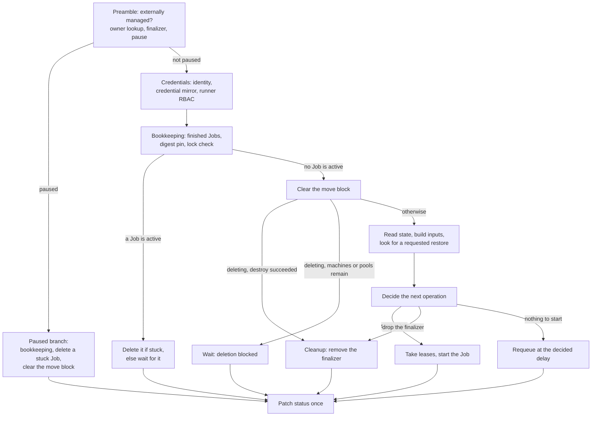

# The Reconcile Lifecycle

`TerraformCluster`, `TerraformMachine` and `TerraformMachinePool` share one
reconcile flow. This page walks through a single pass of it: what runs
before any decision, how the next operation is chosen, how a failed
operation backs off, how two objects of the same cluster stay off each
other's feet, and what each kind does once the shared flow is done. It is
for anyone who wants to know why CAPTF started (or did not start) a Job, or
why a delete is taking a while.

## One pass, one status patch

Every reconcile writes the object's status once, in a single patch at the
end of the pass. Two things are written earlier, directly, because a crash
between them and the deferred patch must not leave a gap:

- the [clusterctl move block](#the-clusterctl-move-block), set just before a
  Job is created;
- the preamble's own writes, described below, which can stop the pass
  before there is anything else to decide.

A reconcile that reaches the end of the pass runs through, in order:

1. **Externally managed.** An object carrying CAPI's externally-managed
   annotation is left alone entirely; nothing below runs.
2. **Owner lookup.** Without an owner reference of the expected kind yet,
   the object waits (`DependenciesReady=Unknown`) unless it is being
   deleted with no state and no running Job, in which case the finalizer is
   dropped at once: there is nothing to destroy. An owner reference whose
   target is gone does not stop deletion; a destroy still runs from the
   durable inputs. An owner gate such as the owning `Cluster`'s
   infrastructure reference not naming a `TerraformCluster` sets
   `DependenciesReady` and stops the pass, unless the object is being
   deleted, in which case deletion proceeds anyway. The lookup also
   requires the owner to reference this object back (its own
   `infrastructureRef`, and, when set, a matching ownerRef UID and
   cluster-name label); an owner that fails this check is treated the same
   as one that is gone: `DependenciesReady=False`/`OwnerMismatch`, no Job,
   and deletion still proceeds. See
   [Owner references are checked against the owner](security-model.md#owner-references-are-checked-against-the-owner)
   for the full rule and why it exists.
3. **Finalizer.** Added if missing; the pass stops for this reconcile so the
   write is visible before anything else happens.
4. **Pause.** A paused object, or one whose `Cluster` is paused, runs only
   the paused branch described below.

See [Conditions](../reference/conditions.md) for every condition this flow
sets and what each reason means, and
[TerraformClusterIdentity](../user-guide/identities.md) for the identity and
credential-mirror step that follows the preamble.

## The paused branch

A paused object still processes its finished Jobs (bookkeeping, below) and
deletes a Job that can never start, but starts nothing new. Once no Job is
active, the clusterctl move block is cleared. This is what `clusterctl
move` waits for after it pauses an object; see
[the move runbook](../operator-guide/runbooks/move.md).

## Bookkeeping

Unpaused, the reconcile reads the object's Jobs and processes every one
that finished since the last pass it was seen: it records the run's steps,
error and drift summary in `status.lastRun`, sets the `ApplyJobSucceeded`
and `DriftJobSucceeded` conditions, pins the image digest of a newly
succeeded apply, prunes history beyond the configured limits, and finds
whether a Job is active now. A stale state lock left by a Job whose pod is
gone is flagged for the next Job to force-unlock; a lock held by something
else (a workstation, another tool) is reported instead. A finished Job's
per-run inputs Secret is deleted once, which is also the point at which its
run lease (and, for a `TerraformCluster`, its cluster write lease) is
given back.

What a finished Job's pod reported is only durable once the status patch at
the end of the pass has succeeded: the reconcile marks a Job "bookkept"
only after that patch, so a failed patch leaves the Job to be read again
next time instead of losing its result.

While a Job is active, state is not read and no new operation is decided:
the reconcile deletes the Job if it looks stuck (its per-run Secret is
missing and no pod ever started, checked only once the Job is at least a
minute old) and otherwise waits, holding the clusterctl move block.

## Choosing the next operation

Once no Job is active, the reconcile reads state, builds the current inputs
(for a mutable kind, or an immutable one not yet provisioned), and looks
for a requested state restore. It then picks the next operation in this
order:

1. A restore named by the `captf.io/restore-state` annotation, unless the
   object is being deleted: it is what was asked for, and checking or
   applying against the state about to be replaced would be wasted or
   worse.
2. Being deleted: `destroy`, or drop the finalizer at once if there is no
   state to destroy.
3. No state yet: `apply` (first apply).
4. State exists but carries no inputs hash: `apply`.
5. A mutable kind whose current inputs hash differs from the one state
   carries: `apply`.
6. A mutable kind whose newest finished apply failed (and was not blocked,
   was not stopped by a plan mismatch, and was not a drift remediation):
   `apply` again, even if the current inputs already match state, because
   the failed run may have changed reality without recording it.
7. A mutable kind with drift found and drift action `Remediate`, while the
   object has not yet reached its remediation-failure cap since the last
   successful drift check: `apply`. Drift detection and remediation are
   [Drift and health](drift-and-health.md)'s topic.

Whichever of those an apply reason names but the first (no state yet, with
nothing to break), an object under `applyPolicy` `Manual` does not apply
directly: it waits for a plan and its approval first, or backs off behind
the destructive-plan guard if neither policy applies. Both are
[Plan approval](../user-guide/plan-approval.md)'s topic; this page only
fixes where that wait sits in the order above.

When none of those apply reasons matched, the reconcile falls through to
its refresh, membership and drift schedule, checked in this order and
stopping at the first one due:

1. A successful apply not yet followed by a `refresh`, for kinds that ask
   for one (a machine or machine pool, so its addresses and health reach
   status without waiting for the next tick).
2. A `TerraformMachinePool` whose membership is still converging: `refresh`
   every 30 seconds, plus jitter, fixed rather than backed off.
3. Otherwise, while health reads pending: `refresh` after a delay that
   starts at 30 seconds and doubles (30s, 1m, 2m, 4m) up to a 5-minute
   ceiling, plus jitter.
4. A machine pool's membership refresh interval elapsed: `refresh`.
5. The health-check interval elapsed: `refresh`.
6. The drift-check interval elapsed: `drift`.
7. Otherwise, requeue at whichever of the above is soonest.

Every interval above adds a small deterministic jitter derived from the
object's UID (up to a tenth of the interval), so objects created together,
such as a `MachineDeployment`'s machines or everything moved by one
`clusterctl move`, do not all check in lockstep. Configuring these
intervals is [Drift and health](drift-and-health.md)'s and
[Configuring drift](../user-guide/drift.md)'s topic; machine pool
membership convergence is [Machine pools](../user-guide/machine-pools.md)'s.

## Retry backoff

A failed Job's operation is not retried immediately: the delay after `n`
consecutive failures of that operation is one minute, doubling each time,
capped at ten minutes. Once `n` reaches the failed-Jobs history limit
(three by default), the delay jumps straight to the ten-minute cap instead
of continuing to double, so the sequence with the default limit is one
minute, two minutes, then ten minutes and no shorter. A Job stopped from
outside (its pod was interrupted, or an apply was blocked before a
destructive plan, or an approved apply's plan changed since approval, or
the run never started because a lease was held) does not count toward this
backoff at all: those wait on a lease, an approval, or the object's own
next reconcile instead. A failed state restore is a special case: it is
never retried for the same backup serial, only for a new one or after the
failed Job is deleted.

## Run leases and the cluster operation gate

Before a Job is created, the reconcile takes the object's own run lease, so
two managers (or two reconciles racing after a crash) never start two Jobs
for the same object at once. If another Job already holds it, the
operation waits instead: `ApplyJobSucceeded`, `DriftJobSucceeded` or
`RestoreJobSucceeded` (matching the operation) goes `Unknown` with a
message naming the Job to wait for.

With the manager's `--cluster-operation-gate` flag (default enabled; see
[Manager configuration](../operator-guide/configuration.md)), an `apply`,
`destroy` or `restore` Job of an object that names a cluster additionally
crosses a second gate meant to keep a cluster's own apply or destroy from
running at the same time as its machines' and machine pools':

- A `TerraformCluster` takes the cluster's write lease, then checks whether
  any machine or machine pool of the cluster is currently applying or
  destroying. If so, it keeps both leases and waits for them to finish
  before it starts: new machine and machine pool operations wait behind it
  meanwhile, so a stream of machine creates cannot starve the cluster's own
  operation.
- A `TerraformMachine` or `TerraformMachinePool` checks whether the
  cluster's write lease is currently held. If it is, the machine or pool
  gives back the run lease it just took and waits for the cluster's
  operation to finish first.

## Deletion order

A `TerraformCluster` being deleted waits for every `TerraformMachine` and
`TerraformMachinePool` carrying its cluster name in the namespace to be
gone before its own destroy runs; machines and machine pools carry no such
wait of their own. An owner reference whose target has already been
removed does not block a destroy: deletion still runs from the durable
inputs. Once a destroy succeeds, or deletion finds no state to destroy at
all, the reconcile deletes the object's state and durable inputs, releases
its leases, drops it from its credential mirror's owners, and removes the
finalizer. See [Secrets](../operator-guide/secrets.md) for what those
Secrets are and [RBAC](../operator-guide/rbac.md) for the namespace RBAC
sweep that follows a finalizer's removal.

## The clusterctl move block

Clusterctl's block-move annotation is set on the object just before a Job
is created and stays set for as long as a Job is active; it is cleared,
paused or not, once no Job is active. `clusterctl move` pauses every object
first and then waits for the annotation to clear, which is why the paused
branch above still runs bookkeeping and the stuck-Job check: a Job that can
never start would otherwise hold the block indefinitely.

## Job names and history

A Job's name is deterministic:
`captf-<kindshort>-<name>-<operation>-a<attempt>-<hash>`, where
`<kindshort>` is `c`, `m` or `mp`, `<attempt>` is one more than the
highest attempt number retained for that operation, and `<hash>` is six
hex characters derived from the inputs hash, the operation, the attempt
and, for `refresh` and `drift`, a tick that changes each time the operation
last succeeded (so a retry finds the same Job instead of starting a second
one); a drift-remediation `apply` and a `restore` carry a tick of their own
too, so neither collides with an unrelated Job of the same inputs hash and
attempt. A name that would exceed 57 characters replaces the object name
with a hash instead. History beyond the configured successful- and
failed-Jobs limits is pruned per operation, oldest first, while always
keeping each operation's newest success and, while no success is newer,
its newest failure, since those are what retry backoff and drift
remediation's failure cap read. Tuning those limits, and the rest of a
Job's resources, deadlines and identity, is
[Job tuning](../user-guide/job-tuning.md)'s topic.

## Jobs per bring-up

Bringing up one `TerraformCluster` with three control-plane and three
worker `TerraformMachine`s runs eight Jobs when each machine's apply
outputs give a definite health reading: one cluster apply, one apply per
machine (six), and one no-change re-apply once the cluster's
`control_plane_initialized` input flips (the cluster's inputs hash
changes, so the shared flow applies again even though nothing else about
the cluster changed). A machine whose apply outputs read pending instead
keeps the extra post-apply refresh described above; with all six machines
reading pending that adds six more Jobs, back up to fourteen. Count Jobs
over a bring-up with `sum(captf_jobs_total)` rather than listing Jobs: a
finished Job is pruned once it falls outside the history limits above.

## After the shared flow

Each kind does a little more once the shared flow has read state and
decided:

- A **`TerraformCluster`** decides its `control_plane_endpoint` input while
  the shared flow builds inputs, and writes an apply's endpoint output
  back to `spec.controlPlaneEndpoint` while state is read: both are part
  of the shared flow, not a separate step. Each happens at most once.
- A **`TerraformMachine`** keeps `cluster.x-k8s.io/remediate-machine` on its
  owning `Machine` in step with its instance health once the shared flow
  finishes, skipped for a paused or externally-managed machine. See
  [Machine health and remediation](../user-guide/remediation.md).
- A **`TerraformMachinePool`** writes its observed replica count back to
  its owning `MachinePool`'s `spec.replicas` when autoscaling is enabled,
  skipped for a paused, externally-managed or deleting pool. See
  [Machine pools](../user-guide/machine-pools.md).

## One pass, visually

## See also

- [Conditions](../reference/conditions.md) — every condition this flow
  sets.
- [Events](../reference/events.md) — the events it emits.
- [Drift and health](drift-and-health.md) — how drift checks and health
  work.
- [The state backend](state.md) — reading and adopting state, and backups.
- [Plan approval](../user-guide/plan-approval.md) — the Manual apply policy
  and the destructive-plan guard.
