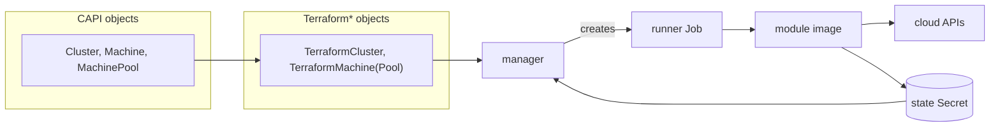

# Introduction

Cluster API Provider Terraform (CAPTF) is a Cluster API infrastructure
provider. It provisions and manages cluster infrastructure by running
Terraform or OpenTofu modules as Kubernetes Jobs, instead of implementing
cloud-specific logic in Go. This page introduces CAPTF's architecture, then
points you at the part of the book you need.

## Why CAPTF exists

Cluster API needs one infrastructure provider per cloud, and most teams
already have Terraform or OpenTofu modules that provision that cloud's
infrastructure. CAPTF turns a module written to its contract into a Cluster
API infrastructure provider directly: you package the module as an OCI
image, and CAPTF runs it, reads its outputs back from state, and reconciles
`Cluster`, `Machine` and `MachinePool` objects against them. There is no Go
controller to write for a new cloud, and no second copy of infrastructure
logic to keep in sync with the module that already exists.

## How it fits together

Cluster API's core objects (`Cluster`, `Machine`, `MachinePool`) reference
CAPTF's own objects (`TerraformCluster`, `TerraformMachine`,
`TerraformMachinePool`) as their infrastructure. The CAPTF manager
reconciles those objects, renders their inputs, and runs a Kubernetes Job
for each operation. The Job's runner executes a Terraform or OpenTofu module
image against those inputs, calling the cloud's own APIs, and its state —
including the outputs the manager reads back — lives in a Kubernetes Secret.
See [Architecture](concepts/architecture.md) for the components behind this
diagram and how one apply flows through them.

## Where to go next

| Section | For | Start here |
| --- | --- | --- |
| Getting Started | Anyone trying CAPTF for the first time | [Quick Start](getting-started/quick-start.md) |
| Concepts | Anyone who needs to understand how CAPTF works | [Architecture](concepts/architecture.md) |
| User Guide | People creating clusters with CAPTF | [Identities and Credentials](user-guide/identities.md) |
| Module Authors | People writing Terraform or OpenTofu modules for CAPTF | [Module Contract](module-author/contract/README.md) |
| Operator Guide | People installing and running the CAPTF manager | [Installation](operator-guide/installation.md) |
| Reference | Everyone | [API Reference](reference/api.md) |
| Developer Guide | People changing CAPTF itself | [Contributing](developer-guide/contributing.md) |

## Project status

Every kind — `TerraformCluster`, `TerraformClusterTemplate`,
`TerraformMachine`, `TerraformMachineTemplate`, `TerraformMachinePool`,
`TerraformMachinePoolTemplate` and `TerraformClusterIdentity` — is at API
version `v1alpha1`. The module contract they implement is also `v1alpha1`
and provisional: it is frozen for implementation, but may still change
before the first real module has provisioned a cluster with it (see the
contract's [changelog](module-author/contract/v1alpha1/CHANGELOG.md)).

CAPTF has no end-to-end tests yet. Its test suite is unit tests that mock
the Kubernetes API and Job execution; nothing in it creates a real cluster.
See [Testing](developer-guide/testing.md) for how the test suite is
organized.
